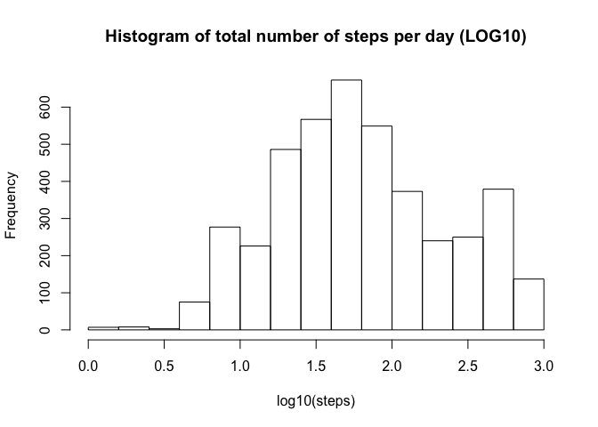
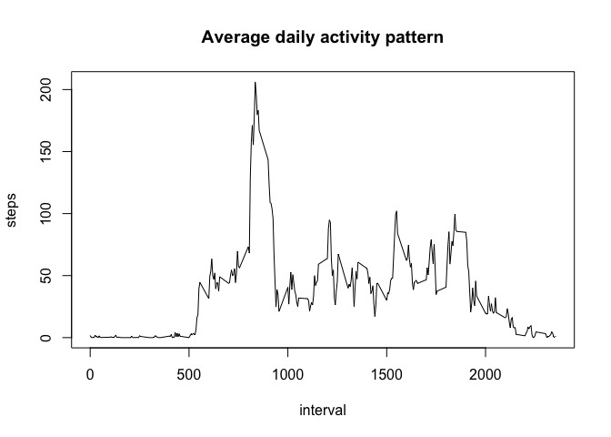
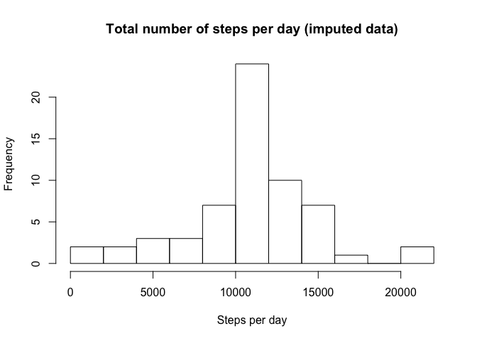
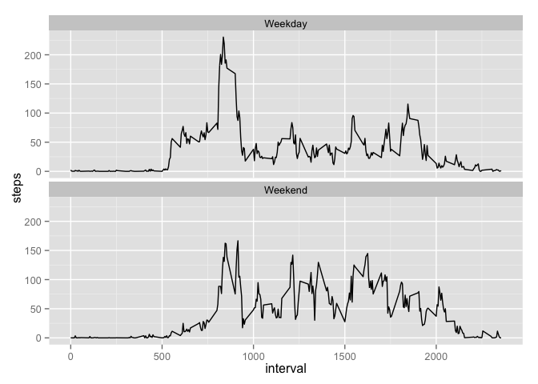

# Reproducible Research: Peer Assessment 1

## Loading and preprocessing the data

```r
activity <- read.csv("~/datasciencecoursera/RepData_PeerAssessment1/activity.csv")
attach(activity)
names(activity)
```

```
## [1] "steps"    "date"     "interval"
```

```r
total_steps<-tapply(steps,date, sum, na.rm=TRUE)
hist(log10(steps), main="Histogram of total number of steps per day (LOG10)")
```

 

```r
mean_day<-mean(total_steps)
median_day<-median(total_steps)
```
###The mean steps taken per day is 9354 steps
###The median steps taken pr day is 10395 steps

## What is the average daily activity pattern?

```r
daily<-aggregate(activity[1], by=activity[3], FUN = mean, na.rm=TRUE)

plot(daily,type="l",main = "Average daily activity pattern")
```

 

```r
daily_max <- max(daily$steps)
daily_max_time <-daily[daily$steps==max(daily$steps),]
```
###The maximum average number of steps is 206 and it occurs after 835 minutes

## Imputing missing values
#Find and report the number of rows with missing values

```r
activity_rows<-nrow(activity)
missing<-sum(is.na(activity$steps))
```
###The activity dataset contains 17568 records but 2304 observations is missing

##The missing observations can be replaced with the mean for that interval

```r
library(plyr)
impute_meanvalues<-function(x) replace(x, is.na(x), mean(x, na.rm=TRUE))
activity_imputed<-ddply(activity,~interval, transform, steps = impute_meanvalues(steps))
imputed_day<- aggregate(activity_imputed[1], by=activity_imputed[2], FUN=sum, na.rm=TRUE)
hist(imputed_day$steps, main="Total number of steps per day (imputed data)", breaks=10, xlab="Steps per day")
```

 

```r
new_mean<-mean(imputed_day$steps)
new_median<-median(imputed_day$steps)
```
###The mean steps taken per day from imputed data is 10766 steps
###The median steps taken pr day from imputed data is 10766 steps

###The imputation of the data with mean values replacing NAs have increased the mean and median values

## Are there differences in activity patterns between weekdays and weekends?

```r
activity_imputed$dateP<-as.POSIXlt(activity_imputed$date, format="%Y-%m-%d")
activity_imputed$day <- "Weekday"
activity_imputed$day[weekdays(activity_imputed$dateP) %in% c("Saturday","Sunday")] <- "Weekend"
#Create plot

activity_imputed_interval <- aggregate(activity_imputed[1],by=activity_imputed[c(3,5)],FUN=mean, na.rm=TRUE)
library(ggplot2)
plot <- ggplot(data=activity_imputed_interval, aes(x=interval,y=steps))
plot + geom_line() + facet_wrap(~day, nrow=2)
```

 
##It seems like the activity is more evenly distributed over the day during weekends comparedt to weekdays
